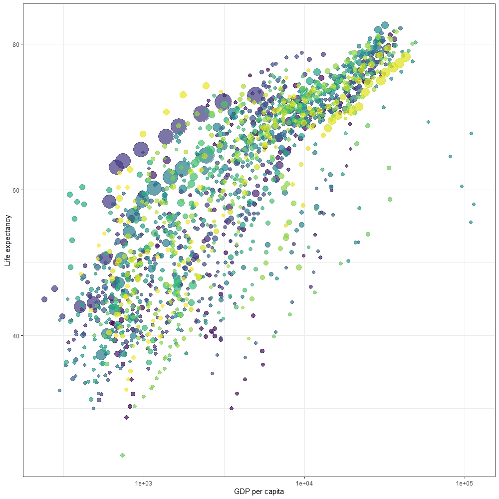
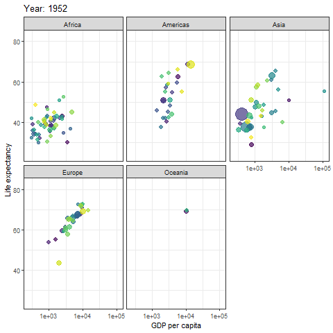
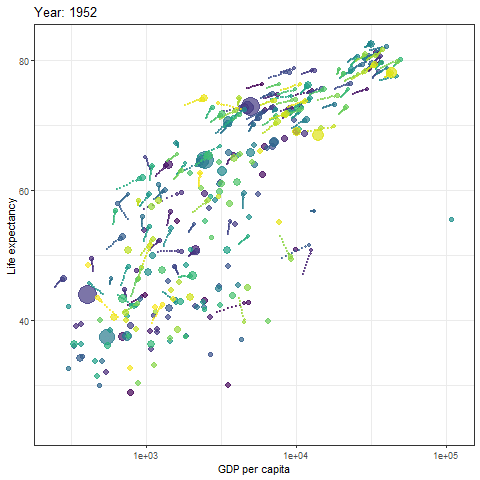
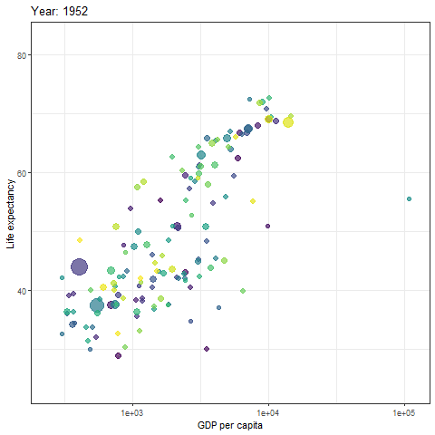
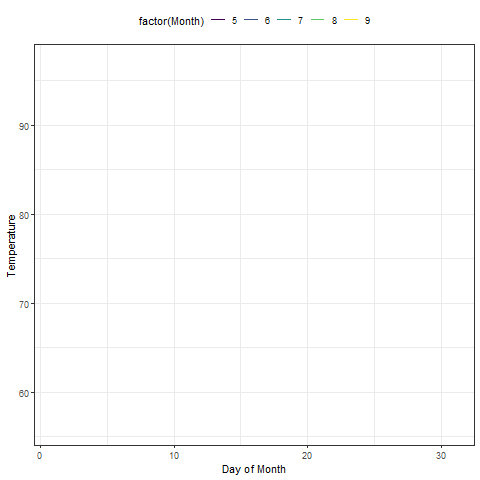
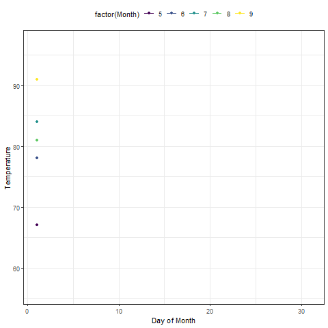

# Plot graph Using R

## Scatter Plot 


```r
install.packages('gganimate')
install.packages('gapminder')
library(ggplot2)
library(gganimate)
theme_set(theme_bw())
library(gapminder)
head(gapminder)
p <- ggplot(
  gapminder, 
  aes(x = gdpPercap, y=lifeExp, size = pop, colour = country)
) +
  geom_point(show.legend = FALSE, alpha = 0.7) +
  scale_color_viridis_d() +
  scale_size(range = c(2, 12)) +
  scale_x_log10() +
  labs(x = "GDP per capita", y = "Life expectancy")
p
```



## add Animation 

```r
p + transition_time(year) +
  labs(title = "Year: {frame_time}")
```


## 

```text
p + facet_wrap(~continent) +
  transition_time(year) +
  labs(title = "Year: {frame_time}")
```



```text

```



```text
p + transition_time(year) +
  labs(title = "Year: {frame_time}") +
  shadow_wake(wake_length = 0.1, alpha = FALSE)
```



```text
p + transition_time(year) +
  labs(title = "Year: {frame_time}") +
  shadow_mark(alpha = 0.3, size = 0.5)
```



```text
p <- ggplot(
  airquality,
  aes(Day, Temp, group = Month, color = factor(Month))
) +
  geom_line() +
  scale_color_viridis_d() +
  labs(x = "Day of Month", y = "Temperature") +
  theme(legend.position = "top")
p

p + transition_reveal(Day)
```



```text
p + 
  geom_point() +
  transition_reveal(Day)
```


```text
p + 
  geom_point(aes(group = seq_along(Day))) +
  transition_reveal(Day)

```

