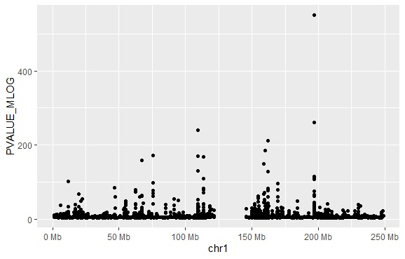

# Rheumatoid Arthritis---Data Analysis using  GWAScat

```r
#For GWAS  analysis we need BiocManager package to be installed 
install.packages("BiocManager")
```

```r
BiocManager::install("ggbio")
BiocManager::install("gwascat")
BiocManager::install("Homo.sapiens")
```

```r
library(gwascat)
objects("package:gwascat")
data(ebicat38)
topTraits(ebicat38)
subsetByTraits(ebicat38, tr="Rheumatoid arthritis")[1:294]
df_main <- data.frame(subsetByTraits(ebicat38, tr="Rheumatoid arthritis")[1:294])
getwd()
write.csv(df_main,"Gwas_RA_ALL.csv", row.names = FALSE)
```

```r
#Basic Manhattan plot
 gwtrunc = ebicat38
 requireNamespace("S4Vectors")
 mcols = S4Vectors::mcols

 mlpv = mcols(ebicat38)$PVALUE_MLOG
 mlpv = ifelse(mlpv > 1000, 1000, mlpv)
 S4Vectors::mcols(gwtrunc)$PVALUE_MLOG = mlpv
 library(GenomeInfoDb)
 seqlevelsStyle(gwtrunc) = "UCSC"
 gwlit = gwtrunc[ which(as.character(seqnames(gwtrunc)) %in% c("chr1")) ]
 library(ggbio)
 mlpv = mcols(gwlit)$PVALUE_MLOG
 mlpv = ifelse(mlpv > 550, 550, mlpv)
 S4Vectors::mcols(gwlit)$PVALUE_MLOG = mlpv
 methods:::cbind2(FALSE)
 autoplot(gwlit, geom="point", aes(y=PVALUE_MLOG), xlab="chr1" )
```

> ## After running this code you get the plot shown below



## 

### 

