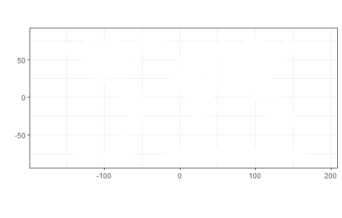
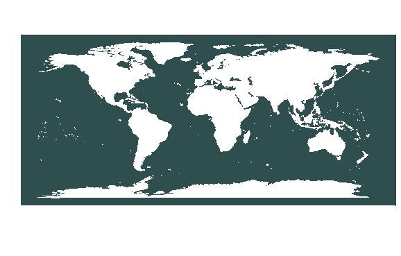
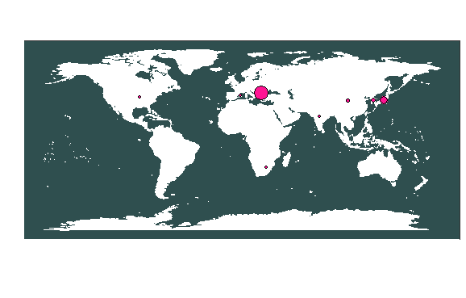

# World Map Plotting

```r
#First install Maps package
install.packages("maps")
```

```r
library(maps)
library(ggplot2)
```

```r
world_map <- map_data("world")
p <- ggplot() + coord_fixed() +
  xlab("") + ylab("")

```

```r
#Add map to base plot
base_world_messy <- p + geom_polygon(data=world_map, aes(x=long, y=lat, group=group), 
                                     colour="darkslategrey", fill="white")

base_world_messy

```



```r
#Strip the map down so it looks super clean (and beautiful!)
cleanup <- 
  theme(panel.grid.major = element_blank(), panel.grid.minor = element_blank(), 
        panel.background = element_rect(fill = 'darkslategrey', colour = 'darkslategrey'), 
        axis.line = element_line(colour = "white"), legend.position="none",
        axis.ticks=element_blank(), axis.text.x=element_blank(),
        axis.text.y=element_blank())

base_world <- base_world_messy + cleanup

base_world
```



```r
# read file  with cordinate data 
df <- read.csv("C:/Users/workc/OneDrive/Desktop/RA_map_cord.csv")
```

```r
map_data_sized <- 
  base_world +
  geom_point(data=df, 
             aes(x=long, y=lat, size=value), colour="Black", 
             fill="Deep Pink",pch=21, alpha=I(1)) 

map_data_sized
 
```



